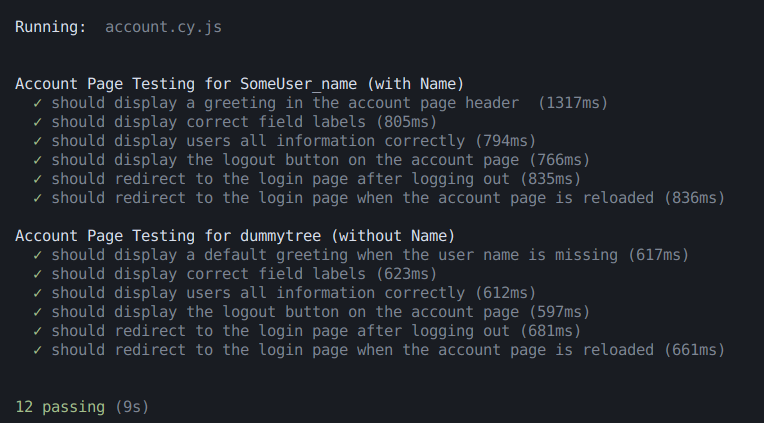
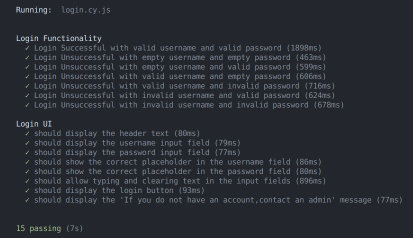
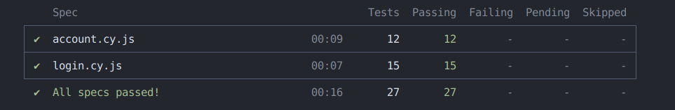
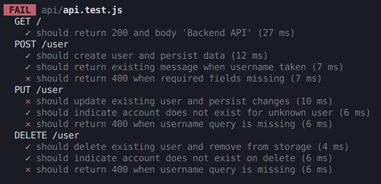

# QA Testing Quiz

### Scenario
The frontend team has developed a prototype login portal for an up and coming platform.
However, they have not implemented any testing yet and it is up to you to do so.

As the QA developer, what is tested and how it is tested is up to you.
Management simply asks that these tests provide as much evidence as possible of the platform's reliability.

### Notes
- Submission must include a link to a public fork/clone of this repository
- We typically use Jest for testing node.js/API related logic and Cypress for testing UI functionality, however, you are more than welcome to use any testing framework you desire so long as you are able to provide reasonable justification

-----------------------------------------------------------------------------------------------------------------------------------------------------------------------------------------------------------------------------

# Testing Implemented
### Test Framework Used
 - Cypress for e2e testing
 - Jest for api testing

## How to Run the Project

### 1. Clone the Repository
```bash
git clone <repository_url>
cd <repository_folder>
```
### 2. Install Dependencies
For Yarn:
```
yarn install
```
For NPM:
```
npm install
```

### 3. Running Jest API Tests
For Yarn:
```
yarn test
```
For NPM:
```
npm test
```

### 4. Running Cypress End-to-End Tests
For Yarn:
```
yarn cypress open  # Open Cypress UI
yarn cypress run   # Run tests in headless mode
```
For NPM:
```
npx cypress open   # Open Cypress UI
npx cypress run    # Run tests in headless mode
```

### Cypress end-to-end testing 










